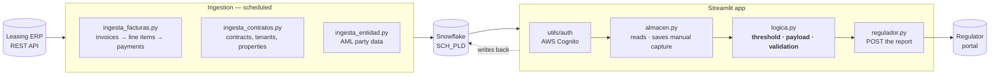

# AML Regulatory Connector

> Leasing ERP → Snowflake → a compliance app → the regulator. Built so the amount
> reported to the authority is the amount actually collected — no more, no less.
> Built at a real estate and media group in Mexico.
> **Anonymized portfolio version — all data is synthetic.**

  

**▶ Live demo:** *(pending deploy — the link goes here)*

---

## The problem

Mexican anti-money-laundering law (LFPIORPI) makes property leasing a *vulnerable
activity*: past a statutory threshold, the lessor has to file a report with the
financial intelligence unit. Get the amount wrong and you are either under-reporting
— a regulatory problem — or over-reporting, which is its own problem and, at volume,
a lot of noise sent to the authority.

The hard part was never the integration. It was the collections logic. On paper a
lease is one rent and one payment. In practice:

- a payment can cover **part** of an invoice;
- one payment can cover **several** invoices;
- VAT and service charges sit **on top of** the rent, and the threshold is tested on
  the rent while the reported amount is the invoice total;
- some contracts are denominated in **another currency**;
- some invoices are issued and never paid in the period.

Model that wrong and the numbers you file are confidently incorrect. Before this,
compliance reconciled it by hand, every month.

## What I built

Three ingestion jobs that mirror invoices, contracts and AML party data into Snowflake,
and a Streamlit application where compliance reviews what the pipeline computed, fills
in the handful of fields the ERP cannot supply, and submits.

| | |
|---|---|
| **Stack** | Python 3.11 · Streamlit · Snowflake · AWS Cognito · Docker · CodeBuild |
| **Scale** | ~1,350 invoices/month · ~5,000 contracts · 49 companies |
| **Outcome** | Manual reconciliation removed; over-reporting eliminated |

---

## Architecture



The app **never calls the ERP**. It reads Snowflake only. That separation is
deliberate: the ingestion can be slow, retried and re-run without anyone waiting on a
screen, and the app stays responsive and read-mostly.

---

## Design decisions

### The threshold and the reported amount are two different numbers

The threshold is tested on **rent**. The amount reported is the **invoice total**, VAT
and service charges included. Conflating them was the original bug: it moved the number
in both directions depending on the contract, and it was the source of the
over-reporting.

The law states the threshold in UMA — a statutory unit republished every year — not in
pesos. `demo/fixtures.py` carries an illustrative value and says so; a real deployment
reads the current figure from the published catalogue. Hard-coding it is how a connector
quietly starts reporting the wrong set of operations a year later.

### One report per contract-month, itemised by instalment

A partial payment is not a smaller operation, and a payment covering three invoices is
not three operations. The report carries one `datosliquidacion` entry per actual
instalment, with its own date, amount and payment method. That is what makes partials
and multi-invoice payments come out right instead of being rounded into a single figure.

### Some fields do not exist in the source, and the app says so

Cadastral reference value, public-registry folio, property type and the beneficial
owner are **not exposed by the ERP** — verified, not assumed. Rather than inventing
defaults, `validate()` blocks submission and names the missing field, and the app gives
compliance a box to fill in. The capture is stored in its own table that ingestion never
touches, so a re-run cannot erase human work.

### Logic separated from UI, storage and network

The original `app.py` was a single file with four commented sections. Publishing split
them into four modules along the lines that were already there:

| Module | What it is |
|---|---|
| `app/logica.py` | SAT catalogues, payload assembly, validation. **Pure functions** |
| `app/regulador.py` | HTTP client for the regulator |
| `app/almacen.py` | Snowflake reads and writes |
| `app/app.py` | the Streamlit UI |

`logica.py` imports nothing but the standard library, so the rules that decide what gets
reported can be tested — and demoed — without Streamlit, Snowflake or a network. This is
the only structural change made to the original.

### Sign-in is real, and configured entirely by environment

`app/utils/auth/` is a full AWS Cognito integration: OAuth2 code flow, JWT signature and
claim validation against the pool's JWKS, session management and a cookie-domain fix for
running behind a proxy. Every value comes from the environment; nothing is in the code.
`ENABLE_AUTH=false` turns it off for local work.

---

## Run the demo

No credentials, no Snowflake, no network.

```bash
git clone https://github.com/chino-bot1701/aml-regulatory-connector.git
cd aml-regulatory-connector
pip install streamlit
streamlit run demo/app_demo.py
```

What you get: 28 synthetic leases across 4 companies and 31 invoices for one period,
covering all five payment patterns. Pick a contract and the page shows the threshold
test, the instalment schedule, the validation result, and the exact JSON the production
app would submit.

**The demo calls the real `build_payload()` and `validate()` from `app/logica.py`,
unchanged.** Only the data source and the submission are replaced.

> The deployed demo is deliberately simpler than the production app — no sign-in, no
> saved state, no live submission. If it is sleeping, the first load takes about 40
> seconds while the free instance wakes up.

### Run the production app

```bash
cp .env.example .env     # fill in
pip install -r app/requirements.txt
streamlit run app/app.py
```

---

## Repository layout

```
app/logica.py             catalogues, payload, validation — pure, testable
app/regulador.py          regulator HTTP client
app/almacen.py            Snowflake reads/writes
app/app.py                Streamlit UI
app/utils/auth/           AWS Cognito: OAuth2, JWT validation, sessions
app/Dockerfile            container image
app/build/buildspec.yml   AWS CodeBuild pipeline
ingesta/ingesta_facturas.py    invoices (rent + variable rent) → PLD_AVISO_CFDI
ingesta/ingesta_contratos.py   contracts, tenants, properties
ingesta/ingesta_entidad.py     AML party data used to pre-fill the form
ingesta/ingesta_entidades.py   raw mirror of every ERP entity
ingesta/seed_pld_catalogos.py  official SAT/AML catalogues
ddl/                      CREATE TABLE for the tables above
demo/fixtures.py          synthetic leases, invoices and payment patterns
demo/app_demo.py          the simplified public demo
```

---

## Notes on anonymization

This is a real production system, rewritten for public release:

- The ERP vendor, the regulator's portal, the group, its companies, tenants, properties
  and the warehouse topology are **renamed**.
- Credentials, endpoints, the container registry and the Snowflake account are read from
  environment variables; see `.env.example`. Nothing is committed.
- All demo data is generated by `demo/fixtures.py` from a fixed seed. No real company,
  tenant, tax ID or amount appears anywhere in this repository.
- The statutory framework (LFPIORPI, the UMA-based threshold, SAT catalogues) is public
  law and is described as it is.

The architecture, the collections logic and the engineering decisions are the real ones.
